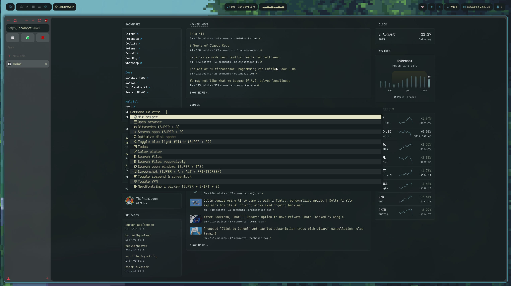
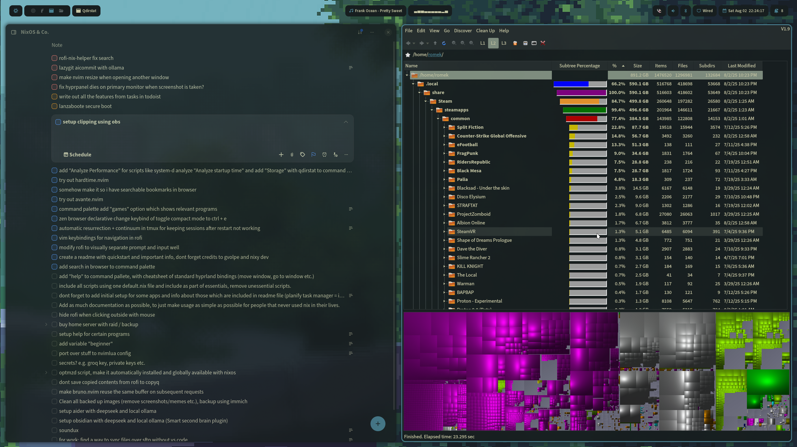
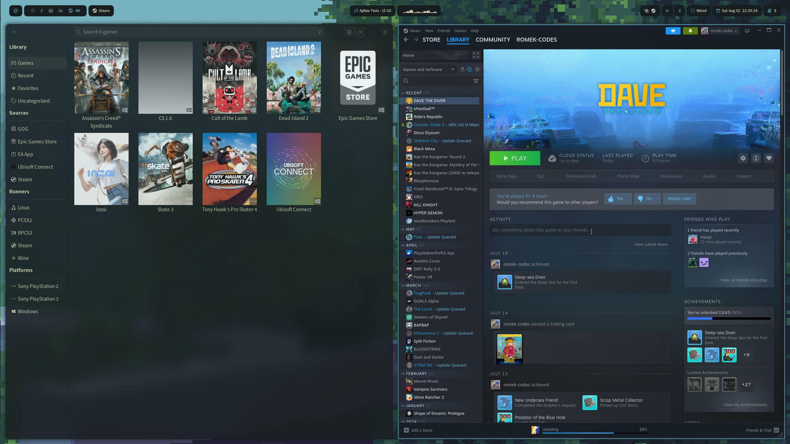

    

 

# nexusystem

 

    
    
    
    

 

## Table of Content

- [Table of Content](#table-of-content)
- [Introduction](#introduction)
- [Gallery](#gallery)
- [Architecture](#architecture)
  - [🏠 /home (User-level configuration)](#-home-user-level-configuration)
  - [🐧 /nixos](#-nixos)
  - [🎨 /themes](#-themes)
  - [💻 /hosts](#-hosts)
- [Installation](#installation)
- [Documentation](#documentation)
- [Credits](#credits)

## Introduction

**Transform your desktop into a productivity powerhouse** with this beautiful, keyboard-driven Linux environment. Built on the lightning-fast Hyprland compositor, this setup delivers a modern, animated workspace that's both stunning and efficient. Whether you're a complete Linux newcomer or a seasoned power user, everything is configured out-of-the-box with *automatic theming*, *easily accessible command palette*, and *declarative configuration* that makes customization effortless.

**Universal Features:**

- 🔎 **Command palette** - perform many actions under one key! See [home/scripts/command-palette/default.nix](home/scripts/command-palette/default.nix)
- 🎨 **Consistent Theming** - base16 & stylix-powered themes across all applications
- ⌨️ **Keyboard-focused navigation** - vim-like keybindings everywhere (Hyprland, nvim, browser, etc.)
- 📦 **Easy package management** - add/remove programs effortlessly, browse available packages at [search.nixos.org](https://search.nixos.org/packages)
- 🌆 **Animated wallpaper support** - easily select an animated or static wallpaper

**For Developers:**

- 💻 **Hyprland-centric** - Preconfigured ecosystem (Hyprlock, Hyprpanel, etc.)
- 🔧 **Pure Lua Neovim** setup (easily modifiable)
- 🖥️ **Multi-machine support** - easily extend config across different systems
- ⚙️ **Variable-based setup** - customize everything through simple configuration variables
- 🏠 **Home-manager integration** - declarative user environment management

**For Creatives:**

- 🎨 **GIMP with Photoshop-like interface** - familiar workflow for designers
- 🎬 **Video editing with Kdenlive** - professional video editing capabilities

**For Gamers:**

- 🎮 **Lutris** - unified launcher for games and emulators (Steam, Epic, retro consoles, etc.)
- 🎯 **Steam integration** - seamless gaming experience with Proton
- 🕹️ **Retro gaming** - PS2, PS3, and other console emulators through Lutris
- ⚡ **Performance optimizations** - gaming-focused kernel and driver configurations

and much more!

## Gallery

## Architecture

### 🏠 /home (User-level configuration)

Contains **dotfiles and settings** that apply to your user environment.

**Subfolders:**

- `programs` is a collection of apps configured with home-manager
- `scripts` is a folder full of bash scripts (see [SCRIPTS.md](docs/SCRIPTS.md))
- `system` is some "desktop environment" configuration

### 🐧 /nixos

Those are the system-level configurations. (audio, bluetooth, gpu, bootloader, ...)

### 🎨 /themes

This folder contains all system themes. Mainly [stylix](https://stylix.danth.me/) configurations.
Check out the available themes and learn how to create your own in [THEMES.md](docs/THEMES.md)

### 💻 /hosts

This directory contains host-specific configurations.
Each host includes:

- `configuration.nix` for system-wide settings
- `home.nix` for user-level configuration
- `variables.nix` for global variables
- `secrets/` for sensitive data

## Installation

If you're new, use the Quickstart below. It covers USB creation, install, host
setup, and rebuild steps.

- [QUICKSTART](QUICKSTART.md)

## Documentation

See the `docs/` folder for full details and guides.

## Credits

Special thanks to the amazing people who made this configuration possible:

- **[gvolpe](https://github.com/gvolpe)** - For helping me dive into the Nix ecosystem. His [configuration](https://github.com/gvolpe/nix-config) was the first I used and modified to create my [own](https://github.com/romek-codes/nix-config), serving as my gateway into the world of declarative system management.

- **[anotherhadi](https://github.com/anotherhadi)** - For the beautiful foundation that became this configuration. His [config](https://github.com/anotherhadi/nixy) provided the elegant base that I've built upon and customized.

This project stands on the shoulders of these contributors and the broader NixOS community. 🙏
