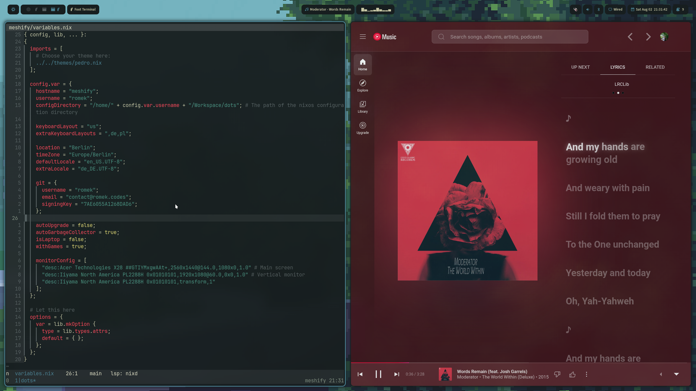
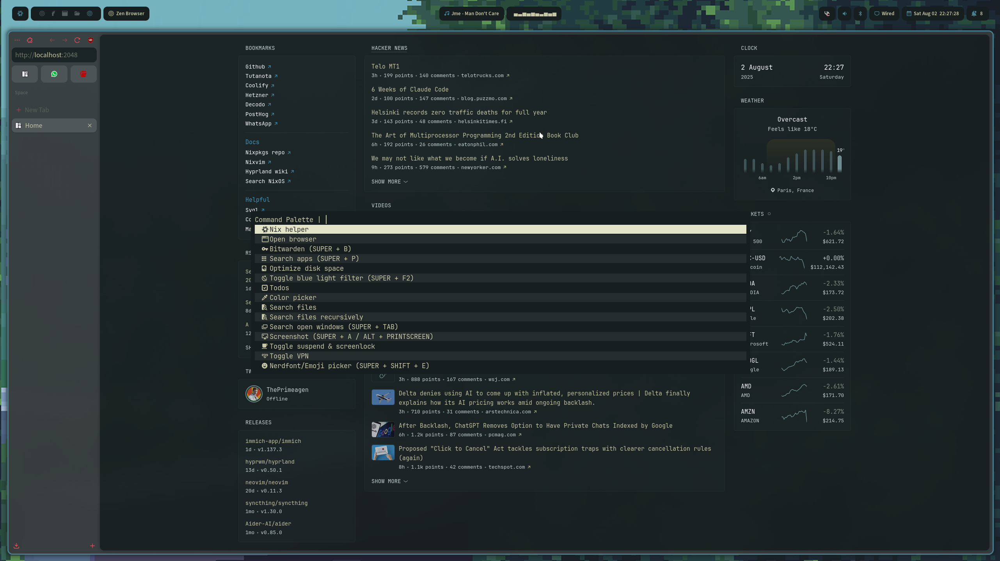
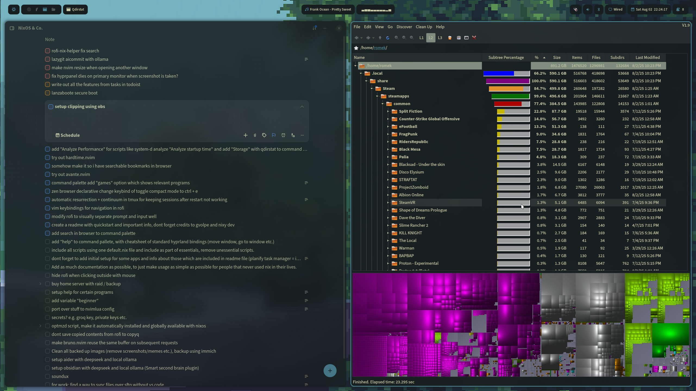

# Themes

Themes are defined in `themes`. Those themes define the colors, fonts, icons, etc, used by Hyprland and the apps/programs installed.
You can change the selected theme by changing the import statement of your host's variables.nix file.

## Create your theme

Create a copy of one of the existing themes and change the variables.

## Gallery

### Pedro

