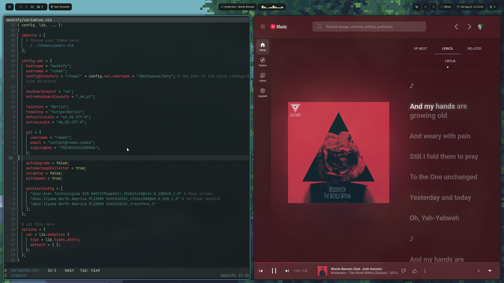
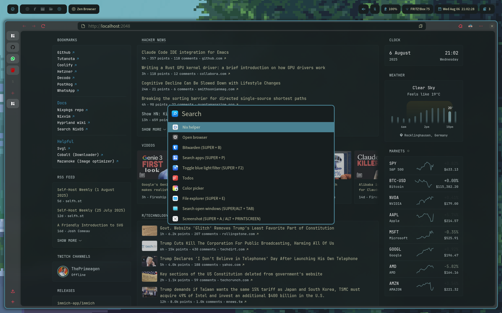

# nexusystem

**Transform your desktop into a productivity powerhouse** with this beautiful,
keyboard-driven Linux environment. Built on the lightning-fast Hyprland
compositor, this setup delivers a modern, animated workspace that's both
stunning and efficient. Whether you're a complete Linux newcomer or a seasoned
power user, everything is configured out-of-the-box with *automatic theming*,
*easily accessible command palette*, and *declarative configuration* that makes
customization effortless.

## Universal Features

- 🔎 **Command palette** - perform many actions under one key! See
  `home/scripts/command-palette/default.nix`.
- 🎨 **Consistent Theming** - base16 & stylix-powered themes across all
  applications.
- ⌨️ **Keyboard-focused navigation** - vim-like keybindings everywhere
  (Hyprland, nvim, browser, etc.).
- 📦 **Easy package management** - add/remove programs effortlessly, browse
  available packages at https://search.nixos.org/packages.
- 🌆 **Animated wallpaper support** - easily select an animated or static
  wallpaper.

## For Developers

- 💻 **Hyprland-centric** - Preconfigured ecosystem (Hyprlock, Hyprpanel, etc.).
- 🔧 **Pure Lua Neovim** setup (easily modifiable).
- 🖥️ **Multi-machine support** - easily extend config across different systems.
- ⚙️ **Variable-based setup** - customize everything through simple
  configuration variables.
- 🏠 **Home-manager integration** - declarative user environment management.

## For Creatives

- 🎨 **Affinity v3** - modern design and photo editing workflow.
- 🎬 **Video editing with Kdenlive** - professional video editing capabilities.

## For Gamers

- 🎮 **Lutris** - unified launcher for games and emulators (Steam, Epic, retro
  consoles, etc.).
- 🎯 **Steam integration** - seamless gaming experience with Proton.
- 🕹️ **Retro gaming** - PS2, PS3, and other console emulators through Lutris.
- ⚡ **Performance optimizations** - gaming-focused kernel and driver
  configurations.

and much more!

## Gallery

## Architecture

The repo is split into a few main areas:

- `home/` for user-level programs, scripts, and UI modules.
- `nixos/` for system-level modules (boot, audio, GPU, networking).
- `themes/` for Stylix/base16 theme definitions.
- `hosts/` for per-machine configuration and variables.

## Installation

If you're new, use the Quickstart below. It covers USB creation, install, host
setup, and rebuild steps.

- [Quickstart](quickstart.md)

## Documentation

See the `docs/` folder for full details and guides, or browse the published docs:
https://romek-codes.github.io/nexusystem/

## Credits

Special thanks to the amazing people who made this configuration possible:

- **[gvolpe](https://github.com/gvolpe)** - For helping me dive into the Nix
  ecosystem. His
  [configuration](https://github.com/gvolpe/nix-config) was the first I used and
  modified to create my
  [own](https://github.com/romek-codes/nix-config), serving as my gateway into
  the world of declarative system management.

- **[anotherhadi](https://github.com/anotherhadi)** - For the beautiful
  foundation that became this configuration. His
  [config](https://github.com/anotherhadi/nixy) provided the elegant base that
  I've built upon and customized.

This project stands on the shoulders of these contributors and the broader
NixOS community. 🙏
